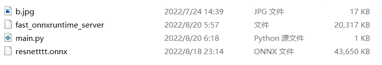
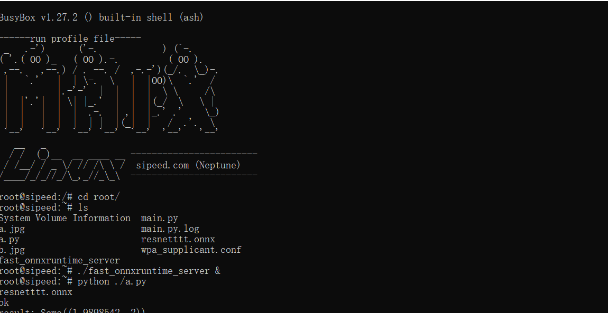
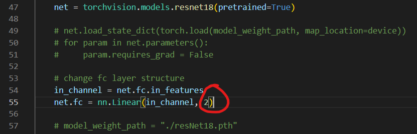

    这个项目使用rust作为后端，实现了一个可以在类似v831这类设备上直接运行onnx模型（基于cpu）

，并且提供了一个可供复现的示例

### 使用：

可以直接在GitHub Releases 下载7z压缩包，压缩包内容如下：

对应文件解释：

| b.jpg                   | 用于识别的示例图片                    |
| ----------------------- | ------------------------------------- |
| fast_onnxruntime_server | 核心，运行main.py之前需要先运行此程序 |
| main.py                 | 一个调用实例，使用了b.jpg             |
| resnetttt.onnx          | onnx模型                              |

运行成功示例（注意这里我讲main.py改成了a.py）：

在python里返回计算的结果为识别的最大index

### 自定义模型：

首先下载项目，设置训练集（gen_onnx/data）：

train为训练集，val为验证集，内部的子文件名随意，每个文件夹一个图片文件，这里代码会自动处理

修改resnet18_train.py文件，主要改第55行，这里第二个参数为识别的类型数，比如我这里只有mouse和sipeed_logo这两个文件所以这里填2

然后运行即可

### 高级：

本项目理论上支持几乎任何操作系统，而且没有特别麻烦的编译依赖，所以你想在windows，Ubuntu上运行也是可以只要保证系统有对应的交叉编译工具链即可

模型不仅仅只支持resnet18而已，本项目仅仅作为示例，你也可以使用自己的模型来运行，需要注意的是，对于图片的处理请保持一致，否则需要更改rust的对应方法并从新编译才行
